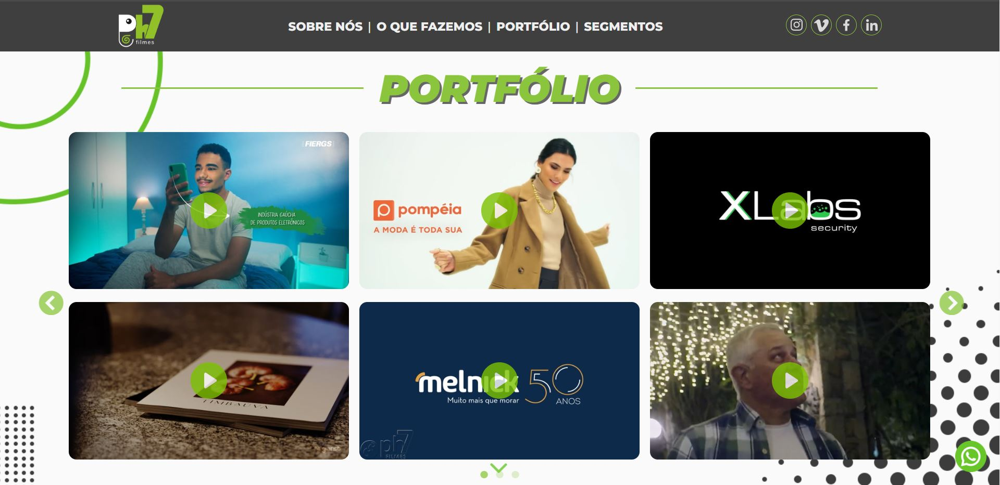

# PH7 Filmes V2 - Novo Site

Projeto desenvolvido para a produtora PH7 Filmes. Pode ser acessado também via http://www.ph7filmes.com.br

# Implementações
- Criação do design, layout e estruturação da página
- Estilização da página
- Animações de interatividade com botões, rolagem e imagens
- Botões de contatos
- Botão de copiar e-mail
- Showroom com vídeo principal
- Carrossel de cards com vídeos da produtora
- Integração dos vídeos pela API do Vimeo
- Sistema de controle de cache para requisições da API
- Visualização dos vídeos em tela cheia
- Código semântico para SEO
- Smooth Scroll
- Responsividade

# Tecnologias utilizadas:
- HTML
- CSS
- JavaScript
- JQuery
- Axios
- VimeoAPI
- Git/GitHub

[Clique aqui para acessar o projeto](https://axlbr.github.io/ph7filmes-v2/)

# Contato
gabrieltoby@gmail.com
